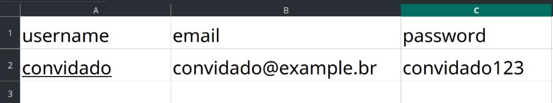

# Friend's Gallery API

This is a REST API project created to fulfill the requirements of a wedding gallery for a friend. The application allows friends to upload photos, which can be approved by the friend and their spouse. Users can like and comment on photos. Additionally, it provides user authentication using the JWT pattern and allows the upload of user data via an Excel spreadsheet.

## Technologies Used

- Django
- Django Rest Framework
- Postgres

## Setup

1. Clone the repository:

```bash
git clone https://github.com/DouglasArS/friend-gallery.git
```

2. Install the required dependencies:

```bash
pip install -r requirements.txt
```

3. Configure the database in the `settings.py` file. Set the database details to use Postgres.

4. Run database migrations:

```bash
python manage.py makemigrations
python manage.py migrate
```

5. Create a superuser to manage the application:

```bash
python manage.py createsuperuser
```

6. Start the development server:

```bash
python manage.py runserver
```

## User Authentication

This API uses JWT (JSON Web Tokens) for user authentication. Users can register and log in to obtain a token for authentication.

Token format: Bearer user-token

## Uploading User Data

Users can upload a spreadsheet (Excel file) containing personal data using the API. The data will be processed and stored in the database.

Excel file format:



## Accessing Swagger Documentation

You can access the Swagger documentation for this API by visiting the following URL when the application is running:

```
http://localhost:8000/swagger/
```

## Postman Collection

To test the API, a Postman collection has been provided. Import the collection into Postman to easily test the API endpoints.

[Download Postman Collection](./friend_gallery/postman_collection.json)

## Additional Improvements

To enhance the solution, consider the following improvements:

- Unit tests: Write comprehensive unit tests to ensure the application's reliability.
- Documentation: Provide detailed API documentation for users and developers.
- Deployment: Host the application on a server of your choice and share the access link with the friend.

## Repository URL

The code for this project can be found on the following GitHub repository:

[GitHub Repository](https://github.com/DouglasArS/friend-gallery)

Feel free to reach out for any further assistance or customization of the application. Enjoy using the Friend's Gallery API!